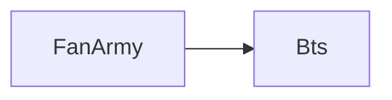
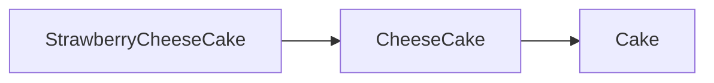

# Java Review - DAY 4
## Ch 14. 클래스의 상속 1: 상속의 기본
### 14-1 상속의 기본 문법 이해
* 상속의 가장 기본적인 특성
```java
class Bts {
	String name;
	public void tellYourName() {
		System.out.println("My group name is " + name);
	}
}

class FanArmy extends Bts { //Bts를 상속하는 FanArmy
	String organization;
	String position;
	public void tellYourInfo() {
		System.out.println("Our organization is based on " + organization);
		System.out.println("Our position is " + position);
		tellYourName(); //Bts 클래스를 상속했기 때문에 호출 가능
	}
}
```
* Bts 클래스: 상속의 대상이 되는 클래스/상위클래스/기초클래스/부모클래스
* FanArmy 클래스: 상속을 하는 클래스/하위클래스/유도클래스/자식클래스
* Bts (참조변수) -> FanArmy 인스턴스
	- String name;
	- String organization;
	- String position;
	- void tellYourName(){..} : Bts의 멤버
	- void tellYourInfo(){..}  


* 상속 관계에 있는 두 클래스의 적절한  생성자 정의
	- 자바는 상속 관계에 있을지라도, 인스턴스 변수는 각 클래스의 생성자를 통해서 초기화해야 한다는 것!
```java
class Bts {
	
	String name;
	
	public Bts(String name) {
		this.name = name;
	}

	public void tellYourName() {
		System.out.println("Our favourite song is " + name);
	}
}

class FanArmy extends Bts { // Bts를 상속하는 FanArmy
	String organization;
	String position;

	public FanArmy(String name, String organization, String position) {
		//상위 클래스의 생성자 호출
		super(name);
		// 클래스 FanArmy의 멤버 초기화
		this.organization = organization;
		this.position = position;
	}
	public void tellYourInfo() {
		System.out.println("Our organization is based on " + organization);
		System.out.println("Our position is " + position);
		tellYourName(); // Bts 클래스를 상속했기 때문에 호출 가능
	}
}

class BtsFanArmy {
	public static void main(String[] args) {
		FanArmy fa = new FanArmy("Butter", "Weverse", "Member");
		fa.tellYourInfo();
	}
}
```
>실행 결과
>Our organization is based on Weverse
Our position is Member
Our favourite song is Butter

### 14-2 클래스 변수, 클래스 메소드와 상속
* static 선언이 붙는 '클래스 변수'와 '클래스 메소드'의 상속
	- 인스턴스의 생성과 상관 없이 접근 가능하다.
	- 클래스 내부와 외부에서(접근 수준 지시자가 허용하면) 접근이 가능하다.
	- 클래스 변수와 클래스 메소드가 위치한 클래스 내에서는 직접 접근이 가능하다.
```java
class SuperClass {
	static int count = 0; //클래스 변수
	public SuperClass() {
		count++; //클래스 내에서는 직접 접근이 가능
	}
}

class SubClass extends SuperClass {
	public void showCount() {
		System.out.println(count);// 상위 클래스에 위치하는 클래스 변수에 접근
	}
}

class SuperSubStatic {
	public static void main(String[] args) {
		SuperClass obj1 = new SuperClass(); //count 값 1 증가
		SuperClass obj2 = new SuperClass(); //count 값 1 증가
		
		//아래 인스턴스 생성 과정에서 SuperClass 생성자 호출되므로,
		SubClass obj3 = new SubClass(); //count 값 1 증가
		obj3.showCount();
	
		}
}
```

## Ch 15. 클래스의 상속 2: Overriding
### 15-1 상속을 위한 두 클래스의 관계
* 상속의 기본 조건 'IS-A 관계'
	- 하위 클래스는 상위 클래스의 모든 특성을 지닌다.
	- 더불어, 하위 클래스는 자신만의 추가적인 특성을 더하게 됨.
	- 인생은 여행이다./노트북은 컴퓨터이다.....등 IS-A 관계
	- class Laptop extends Computer { ... }

### 15-2 메소드 오버라이딩 (재정의)
* 상위 클래스의 참조변수는 하위 클래스의 인스턴스를 참조할 수 있음.
* 참조변수의 형을 기준으로 접근 가능한 멤버를 제한하는 것은 코드를 단순하게 함.
* 클래스의 상속과 참조변수의 참조 가능성에 대한 정리


> Cake cake1 = new StrawberryCheeseCake();
> CheeseCake cake2 = new StrawberryCheeseCake();
> cake1.sweet();//Cake에 정의된 메소드 호출
> cake2.sweet();//Cake에 정의된 메소드 호출
> cake2.milky(); //CheeseCake에 정의된 메소드 호출

* 참조변수 간 대입과 형 변환
> class Cake {
> public void sweet() {...} }
> class CheeseCake extends Cake { public void milkey() {...}}
> CheeseCake ca1 = new CheeseCake();
> Cake ca2 = ca1; //가능
> Cake ca3 = new CheeseCake();
> CheeseCake ca4 = ca 3; // 불가능
> Cake ca3 =...
> CheeseCake ca4 = (CheeseCake)ca3; //가능

* 클래스의 상속과 참조변수의 참조 가능성: 배열 관점에서의 정리
* CheeseCake[] cakes = new CheeseCake[10];

* 메소드 오버라이딩 (Method Overriding) -> 무효화 시키다;;
> Cake c1 = new Cheesecake();
> CheeseCake c2 = new CheeseCake();
> c1.yummmy();//오버라이딩 한 CheeseCake의 yummy 메소드 호출
> c2.yummy()// 동일
* 메소드의 이름, 반환형, 매개변수 선언 -> 이 세가지 같아야 '메소드 오버라이딩' 성립함.
* 메소드 오버라이딩의 일반화
> > Cake c1 = new StrawberryCheesecake();
> CheeseCake c2 = new StrawberryCheeseCake();
> StrawberryCheeseCake c3 = new StrawberryCheeseCake();
* super.yummy(); 사용시 Cake의 yummy 메소드 호출 가능. 즉, 오버라이딩 된 메소드의 호출을 목적으로도 super가 사용됨.
* 인스턴스 변수와 클래스 변수도 오버라이딩 대상? 
	- 변수는 오버라이딩 되지 않음. 참조변수의 형에 따라서 접근하는 변수가 결정됨. 클래스 변수와 클래스 메소드도 오버라이딩 대상 아님.
### 15-3 instance of 연산자
* instance of 연산자의 기본
	- 연산자 instanceof는 참조변수가 참조하는 인스턴스의 '클래스'나 참조하는 인스턴스가 '상속하는 클래스'를 묻는 연산자.
> if (cake instanceof Cake) ... true/false
	- 연산자 instanceof는 명시적 형 변환의 가능성을 판단해주는 연산자이다.
```java
package InstanceOf;

class Box {
	public void simpleWrap() {
		System.out.println("Simple Wrapping");
	}
}

class PaperBox extends Box {
	public void paperWrap() {
		System.out.println("Paper Wrapping");
	}
}

class GoldPaperBox extends PaperBox {
	public void goldWrap() {
		System.out.println("Gold Wrapping");
	}
}

public class Wrapping {

	public static void main(String[] args) {
		Box box1 = new Box();
		PaperBox box2 = new PaperBox();
		GoldPaperBox box3 = new GoldPaperBox();
		
		wrapBox(box1);
		wrapBox(box2);
		wrapBox(box3);

	}
	
	public static void wrapBox(Box box) {
		if (box instanceof GoldPaperBox) {
			((GoldPaperBox)box).goldWrap(); //형 변환 후 메소드 호출
		}
		else if (box instanceof PaperBox) {
			((PaperBox)box).paperWrap(); //형 변환 후 메소드 호출
		}
		else {
			box.simpleWrap();
		}
	}
}
```
* 연산자 instanceof는 명시적 형 변환의 가능성을 판단해주는 연산자이다.

## Ch 16. 클래스의 상속 3: 상속의 목적
### 16-1 상속이 도움 되는 상황
* 상속의 목적: 연관된 일련의 클래스들에 대해 공통적인 규약을 정의
```java
class Friend {//친구 공통 정보
	protected String name;
	protected String phone; //상속하는 클래스에 사용가능

	public Friend(String na, String ph) {
		name = na;
		phone = ph;
	}
	public void showInfo() {
		System.out.println("이름: " + name);
		System.out.println("전화: " + phone);
	}
}

class UnivFriend extends Friend {//Friend 클래스를 상속함
	private String major;
	
	public UnivFriend(String na, String ma, String ph) {
		super(na, ph);
		major = ma;
	}
	public void showInfo() {
		super.showInfo();
		System.out.println("전공: " + major);
	}
}

class CompFriend extends Friend {//Friend 클래스를 상속함
	private String department;
	
	public CompFriend(String na, String de, String ph) {
		super(na, ph);
		department = de;
	}
	public void showInfo() {
		super.showInfo();
		System.out.println("부서: " + department);
	}
}

public class MyFriend {
	public static void main(String[] args) {
		Friend[] frns = new Friend[10];
		int cnt = 0;
		
		frns[cnt++] = new UnivFriend("V", "Computer", "010-1234-5678");
		frns[cnt++] = new UnivFriend("RM", "English", "010-1111-5678");
		frns[cnt++] = new CompFriend("Suga", "Composition", "010-2222-5678");
		frns[cnt++] = new CompFriend("Jimin", "Dance", "010-3333-5678");

		//모든 동창 및 동료의 정보 전체 출력
		for(int i = 0; i < cnt; i++) {
			frns[i].showInfo();//오버라이딩 한 메소드가 호출됨.
			System.out.println();
		}			
	}
}
```
* Friend 클래스 목적: UnivFriend클래스와 CompFriend 클래스에 공통 규약을 적용하기 위해 정의된 클래스
	- 인스턴스를 저장하는 배열이 하나이다. 
		* -> Friend 클래스를 상속하는 클래스가 더 추가되어도 이 사실은 변함이 없다.
	- 정보를 저장하는 과정이 나뉘지 않는다.
		* -> 하나의 배열에 모든 인스턴스를 저장할 수 있다.
	- 저장된 정보를 모두 출력할 때 하나의 for문으로 충분하다.
		*-> 하나의 배열이 사용되었고 또 메소드 오버라이딩이 도움이 되었다.
### 16-2 Object 클래스와 final 선언 그리고 @Override
* 모든 클래스는Object 클래스를 상속함.
	- java.lang 패키지에 묶여 있는 Object 클래스를 상속함.
	- class MyClass extends Object {...} 하지만 상속하는 클래스가 있는 경우에는 Object 클래스를 상속하지 않음. 그러나 다른 클래스가 Object을 직/간접으로 상속하게 되어있음.
	- public void println(Object x) -> System.out.println 메소드
		* 위 메소드의 매개변수 형이 Object임. 모든 인스턴스 위 메소드의 인자가 될 수 있음. 메소드는 이자로 전달된 인스턴스의 다음 메소드를 호출함. 이 메소드는 Object 클래스에 정의되어 있는 메소드이므로 모든 인스턴스를 대상으로 호출이 가능함. 
		* public String toString(), 즉 Object 클래스의 toString 메소드를 오버라이딩 한 것임.

```java
class Cake {
	//Object 클래스의 toString 메소드를 오버라이딩
	public String toString() {
		//Object 클래스의 toString 메소드 호출하여 반환 결과 출력
		System.out.println(super.toString());
		return "My birthday cake";
	}
}
class CheeseCake extends Cake {
	//Cake 클래스의 toString 메소드를 오버라이딩
	public String toString() {
		return "My birthday cheese cake";
	}
}
public class OverridingToString {

	public static void main(String[] args) {
		Cake c1 = new Cake();
		Cake c2 = new CheeseCake();
		
		//c1이 참조하는 인스턴스의 toString 메소드 호출로 이어짐
		System.out.println(c1);
		System.out.println();
		
		//c2가 참조하는 인스턴스의 toString 메소드 호출로 이이점
		System.out.println(c2);
	}
}
```
* System.out.println(super.toString());
* 실행 결과:  
	- InstanceOf.Cake@cac736f 
	- My birthday cake
	- My birthday cheese cake
* 클래스와 메소드의 final 선언: 해당 클래스를 다른 클래스 상속하는 것 원치 않을 때 final 선언하면 됨.
	- public final class MyLastCLS {...} : 다른 클래스 상속 안됨
> class Simple {
> //아래의 메소드는 다른 클래스에서 오버라이딩 할 수 없음
> public final void func(int n) {...} 
> }

* @Override
	- "Annotation은 일종의 메모로 자바 컴파일러에게 메시지를 전달하는 목적 -> 이 메소드는 상위 클래스의 메소드를 오버라딩 할 목적으로 정의하였음. 
	- 하기 예제는 메소드 매개변수 형과 반환영 달랐으나 annotation없이는 컴파일 실행 됨. 이를 방지하기 위해 어노테이션 사용. 
```java
package InstanceOf;

class ParentAdder {
	public int add(int a, int b) {
		return a + b;
	}
}

class ChildAdder extends ParentAdder {
	//상위 클래스의 add를 오버라이딩 하려 합니다.
	@Override //이거 넣으면 error: method does not override or implement a method from a supertype 
	public double add(double a, double b) {
		System.out.println("덧셈을 진행합니다.");
		return a + b;
	}
}

class OverrideMistake {
	public static void main(String[] args) {
		ParentAdder adder = new ChildAdder();
		System.out.println(adder.add(3, 4));
	}
}
```
### 17-2 인터페이스의 문법 구성과 추상 클래스
* 인터페이스에 존재할 수 있는 메소드: 
	- 추상 메소드
	- 디폴트 메소드
	-   static 메소드
* 클래스와 유사한 특성
	- 인터페이스 간 상속도 가능
	- 인터페이스의 형(Type) 이름을 대상으로 instanceof 연산 가능
1. 추상 메소드
* 인터페이스의 모든 메소드는 public으로 선언된 것으로 간주함. (별도의 선언 없어도 public이 됨)
* 인터페이스 내에 선언되는 변수 특징
	- 1) 반드시 선언과 동시에 값으로 초기화 해야함.
	- 2) 모든 변수는 public, static, final이 선언된 것으로 간주함.
>interface Printable {
>int PAPER_WIDTH = 70;
>int PAPER_HEIGHT = 120;
>void print(String doc);
> }
* 인터페이스 내에 선언된 변수는 상수. final과 static으로 자동 선언되니 다음과 같이 가능한 상수.
> System.out.println(Printable.PAPER_WIDT); //인터페이스 내에 위치한 상수의 접근
* 마지막으로 인터페이스를 구현하는 클래스는 인터페이스에 존재하는 모든 '추상 메소드'를 구현해야함. 하나라도 구현하지 않으면, 해당 클래스를 대상으로 인스턴스 생성 불가능. (즉 다 채워지지 않았으므로 인턴스턴 생성 불가능함)

2. 인터페이스 간 상속
* S사 새로운 모델 프린터 출시
> interface ColorPrintable extends Printable { //Printable을 상속하는 인터페이스 
> void printCMYK(string doc);
* 인터페이스 상속으로 기존에 제작 및 배포가 되어 사용 중인 드라이버 수정 필요 없게 됨. 인터페이스 사이에도 상속 가능. 
	- 두 클래스 사이 상속 extends로 명시함.
	- 두 인터페이스 사이 상속도 extends로 명시함.
	- 인터페이스와 클래스 사이의 구현만 implements로 명시함.

3. 인터페이스의 디폴트 메소드 (Default Method)
* 문제: 이미 정의되어 다양한 프로젝트에 사용 중인 수십 개의 인터페이스가 있는데, 대대적인 기능 보강을 위해 모든 인터페이스에 최소 한 개 이상의 추상 메소드를 추가해야 하는 상황. 
* 인터페이스 상속으로 해결하면, 인터페이스의 수는 두배로 늘어남
* 해결 방법: Default Method
> interface Printable {
> void print(String doc);
> default void printCMYK(String doc) { } //인터페이스의 디폴트 메소드 }
* 디폴트 메소드 특징
	- 자체로 완전한 메소드 (비록 인터페이스 내에 정의되어 있지만)
	- 따라서 이를 구현하는 클래스가 오버라이딩 하지 않아도 됨.
* 즉, 디폴트 메소드는 인터페이스에 추상 메소드를 추가해야 하는 상황에서, 이전에 개발해 놓은 코드에 영향을 미치지 않기 위해 등장한 문법.

4. 인터페이스의 static 메소드(클래스 메소드)
```java
package Interface;

interface Printable {
	static void printLine(String str) {
		System.out.println(str);
	}
	default void print(String doc) {
		printLine(doc); //인터페이스 static 메소드 호출
	}
}

//인터페이스 Printable에는 구현해야 할 메소드가 존재하지 않음.
class Printer implements Printable { } 

public class SimplePrinter {
	public static void main(String[] args) {
		String myDoc = "This is a report about...";
		Printable prn = new Printer();
		prn.print(myDoc);
		//인터페이스 static 메소드 직접 호출
		Printable.printLine("end of line");
	}
}
```
* 실제 프로그래머가 static 메소드 정의하는 것 드뭄.... 그냥 이런 방법이 있음.. 클래스 static 메소드 호출 방법과 같음.

5. 인터페이스 대상의 instanceof 연산
```java
package Interface;

interface Printable {
	 void printLine(String str);
	}

	class SimplePrinter implements Printable { // Printable 직접 구현함
		public void printLine(String str) {
			System.out.println(str);
		}
	}

	class MultiPrinter extends SimplePrinter { // Printable을 간접 구현함
		public void printLine(String str) {
			super.printLine("start of multi...");
			super.printLine(str);
			super.printLine("end of multi");
		}
	}

public class InstanceofInterface {
	public static void main(String[] args) {
		Printable prn1 = new SimplePrinter();
		Printable prn2 = new MultiPrinter();
		
		if(prn1 instanceof Printable)
			prn1.printLine("This is a report about...");
		System.out.println();
		
		if(prn2 instanceof Printable)
			prn2.printLine("This is a multiful printer.");
	}
}
```
6. 인터페이스의 또 다른 사용 용도: Marker Interface
* 인터페이스는 클래스에 특별한 표식을 다는 용도로도 사용됨. 
> interface Upper {  } //Marker Interface
> interface Lower {  } //Marker Interface
>...
>if(doc instanceof Upper) {...}
>if(doc instanceof Lower){..} 
* public String toUpperCase() //문자열의 모든 문자를 대문자로 바꿈.
* public String toLowerCasE() //문자열의 모든 문자를 소문자로 바꿈.

7. 추상 클래스: 하나 이상의 추상 메소드를 갖는 클래스
```java
public abstract class House { //추상 클래스
	public void methodOne() {
		System.out.println("method one");
	public abstract void methodTwo(); //추상 메소드
}
```
* 클래스 선언부에 abstract 선언 추가 (인터페이스와 유사함)
* 추상 클래스를 대상으로 인스턴스 생성도 불가능하며 다른 클래스에 의해서 추상 메소드가 구현 되어야 함. 클래스는 구현이 아닌 상속의 형태를 띔! (키워드 extends를 사용)
```java
public class MyHouse extends House {
	@override
	public void methodTwo() {
		System.out.println("method two");
		}
}
```
* 즉, 다른 클래스와 같이 인스턴스 변수와 인스턴스 메소드 갖지만, 이를 상속하는 하위 클래스에 의해서 구현되어야 할 메소드가 하나 이상 있는 경우 '추상 클래스'.

## Ch 18. 예외 처리 (Exception Handling)
###18-1 자바 예외처리의 기본
> java.lang.ArithmeticException : 수학 연산 오류
> java.util.InputMismatchException: 클랫 Scanner 통한 값의 입력에서의 오류
* 예외의 처리를 위한 try ~ catch
> try { ...관찰 영역
> }
> catch(Exception name) {
> ...처리 영역...
> }
> "try 영역에서 발생한 예외 상황을 catch 영역에서 처리한다."
```java
package Exception;

import java.util.Scanner;

public class ExceptionCase {

	public static void main(String[] args) {
		Scanner sc = new Scanner(System.in);
		
		try { 
			System.out.println("a/b...a? ");
			int n1 = sc.nextInt();
			System.out.println("a/b...a? ");
			int n2 = sc.nextInt();
			System.out.printf("%d / %d = %d \n", n1, n2, n1 / n2);//예외 발생 지점
		}
		catch(ArithmeticException e) {
			System.out.println(e.getMessage());
		}//입렵갑 오류시 (InputMismatchException e)	
		System.out.println("Good bye~~!");
	}
}
```
>  실행 결과
>a/b...a? 
8
a/b...a? 
0
/ by zero
Good bye~~!

* 둘 이상의 예외 처리하기 위한 구성
	> catch 구문 둘 일어서 구성하면 됨
	> catch(AsrithmeticException | InputMismatchException e) {
	e.getMessage(); 
	}
* Throwable 클래스와 예외처리의 책임 전가
> java.lang.Throwable: 예외 클래스의 최상위 클래스
> public String getMessage() -> 예외의 원인을 담고 있는 문자열 반환
> public void printStackTrace() -> 예외가 발생한 위치와 호출된 메소드의 정보를 출력
> try { m1(3);//md1으로부터 예외가 넘어옴.
> }
> catch(Throwable e) {
> e.printStackTrace();
> }
* 예외 상황을 알리기 위해 정의된 클래스의 종류
> ArrayIndexOutOfBoundsException: 배열 접근에 잘못된 인덱스 값을 사용해서 발생하는 예외의 상황
> ClassCastException : 형 변환을 강제로 진행하는 경우 발생
> NullPointerException: null이 저장된 참조변수를 대상으로 메소드 호출할 때 발생하는 예외의 상황.
* 예외 클래스의 구분
> Error 클래스를 상속하는 예외 클래스
> Exception 클래스를 상속하는 예외 클래스
> RuntimeException 클래스를 상속하는 예외 클래스 -> RuntimeException 클래스는 Exception 클래스를 상속한다.
* Error 클래스를 상속하는 예외 클래스
> VirturalMachineError: 가상머신에 심각한 오류 발생
> IOError: 입출력 관련해서 코드 수준 복구가 불가능한 오류 발생
* 모든 예외 클래스
	- ArithmeticException
	- ClassCastException
	- IndexOutOfBoundsException
	- NegativeArraySizeException: 배열 생성시 길이를 음수로 지정하는 예외의 발생, Object[] ar1 = new Object[-5];
	- NullPointerException
	- ArrayStoreException: 배열에 적절치 않은 인스턴스를 저장하는 예외의 발생
* Exception을 상속하는 예외 클래스의 예외처리
> java.io.IOException
* try ~ catch문을 통해서 IOException을 직접 처리
* or throws IOException 선언을 추가해서 예외의 처리를 넘기거나 
	- main 메소드에 예외를 넘기면, 이 예외는 main 호출한 가상머신에게 넘어감. 
* 프로그래머가 정의하는 예외
	- class ReadAgeException extends Exception { //Exception을 상속하는 것이 핵심
		public ReadAgeException() {
		super("유효하지 않은 나이가 입력되었습니다."); } } 
	- public String getMessage() 호출시 반환 

* finally 구문
	-	 try~ finally~
	-	try ~ catch ~ finally~
> write = Files.newBufferedWriter(file);
> writer.close(); //반드시 실행해야 하는 문장
> finally {
>  if(write !=null)
> write.close(); // IOException 발생 가능
> }

* try-with-resources 구문
	- writer = Files.newBufferedWriter(file);
	- writer.close();
> try( resource1; resource2) {...
> }
> catch(Exception name) {...
> }
* writer.close(); //직접 이 문장 넣지 않아도됨.  -> java.lang.AutoCloseable 인터페이스는 try-with-resources문에 의해 자동으로 종료되어야 할 리소스 관련 클래스가 반드시 구현해야 하는 인터페이스. -> 추상 메소드 존재 void close() throws Exception
* try 구문 안에 위치한 코드는 밖에 위치한 코드에 비해 실행 속도가 느림. 과도한 예외처리는 지양해야함.
