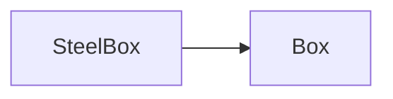

# Java Review - DAY 5

## Ch 19. 자바의 메모리 모델과 Object 클래스
### 19-1 자바 가상머신의 메모리 모델
* Main Memory: 프로그램의 실행에 필요한 메모리 공간, 물리적으로 RAM
* 자바 가상머신은 운영체제가 할당해 주는 메모리 공간을 기반으로 스스로를 실행하면서 더불어 자바 응용 프로그램의 실행 도움.
 1. 메소드 영역 (Method Area): 메소드의 바이트코드, static 변수
* 바이트 코드 (Bytecode)란 소스파일을 컴파일할 때 생성되는, 자바 가상머신에 의해 실행이 가능한 코드. 바이트코드도 메모리 공간에 존재해야 실행이 가능함.
> Bts b = new Bts(); //인스턴스 생성
> Bts.average += 5; //클래스 변수 접근
* 인스턴스의 생성 및 클래스 변수의 접근을 위해서 먼저 해당 클래스의 바이트 코드가 메모리 공간에 로딩되어야 하는데(메모리 공간에 올려져야 함), 이때 로딩되는 메모리 공간이 '메소드 영역'임. 메소드 영역은 특정 클래스의 정보가 메모리 공간에 올려질 때 채워지는 영역.
 2. 스택 영역 (Stack Area): 지역변수, 매개변수가 저장되는 공간.
 * 중괄호로 구분되는 지역 내에서만 유효한 변수들임. 중괄호를 벗어나면 바로 소멸되는 특성의 데이터 저장을 위한 영역이 스택임.
 * 지역변수와 매개변수는 선언되는 순간에 스택에 할당되었다가  자신이 할당된 영역을 벗어나면 소멸됨
 * args -> num1 -> num2
 3. 힙 영역 (Heap Area): 인스턴스는 힙 영역에 할당됨. 
 * 인스턴스와 참조변수의 메모리 할당
 
| String str1  | = | new String("My String"); |
|--|--|--|
|str1  | 참조 | "My String"  |
|참조/지역변수| 참조 | 인스턴스|
|스택영역 | -> | 힙 영역|
* 인스턴스의 소멸시기를 결정하는 것은 가상머신의 역할
* 자바 가상머신의 인스턴스 소멸시기
> str1 = null; // 참조 관계 소멸 즉 인스턴스는 소멸의 대상이 되어 가상머신에 의해 소멸이 이뤄짐.
*  Garbage Collection: 자바의 인스턴스 소멸 방식
* 힙 영역은 가상머신에 의한 가비지 컬렉션이 일어나는 메모리 공간임.
* 가비지 컬렉션이 발생하는 시점: 인스턴스가 가비지 컬렉션의 대상이 되었다고 해서 바로 소멸되는 것은 아님. 성능 영향 미치지 않도록 별도의 알고리즘을 기반으로 계산되어 그 결과 기반으로 수행됨.
### 19-2 Object 클래스
* 인스턴스 소멸되기 전 자동으로 호출되는 메소드: finalize 메소드의 오버라이딩 고려할 수 있음.
>@Override
>protected void finalize() throws Trowable {
>super.finalize( ); //상위 클래스의 finalize 메소드 호출
>....}
* 상위 클래스 finalize 메소드에 삽입되어 있는 코드들이 실행되도록 하자. 
	- 가비지 컬렉션은 빈번히 일어나지 않음
	- 소멸할 인스턴스가 생겨도 가비지 컬렉션으로 바로 이어지지 않음.
> public static void gc() -> 가비지 컬렉션은 수행을 요청 (명령이 아닌 요청)
> public static void runFinalization() -> 소멸이 보류된 인스턴스의 finalize 메소드 호출을 요청 (명령이 아닌 요청)
* 가비지 컬력션을 강제로 진행하지 말것!
* 인스턴스의 비교: equals  메소드 
```java
	@Override 
	public boolean equals(Object obj) {
			if(this.num == ((INum)obj).num)
				return true;
			else
				return false;
	}
```
== 연산자와 같이 참조변수의 참조 값을 비교하도록 정의되어 있으나 이미 == 연산 통해 비교 가능하므로equals 메소드의 호출을 통해 참조값 비교 필요 없음. equals 메소드는 내용 비교가 이뤄지도록 오버라이딩 하라고 존재하는 메소드임. 
```java
public class StringEquality {
	public static void main(String[] args) {
		String str1 = new String("So Simple");
		String str2 = new String("So Simple");
		
		//참조 대상을 비교하는 if ~ else문
		if(str1 == str2)
			System.out.println("str1, str2 참조 대상 동일함.");
		else
		System.out.println("str1, str2 참조 대상 다름.");
		
		//두 인스턴스 내용 비교하는 if ~ else문
		if(str1.equals(str2))
			System.out.println("str1, str2 내용 동일함.");
		else
			System.out.println("str1, str2 내용 다름.");
	}
}
```
> 실행 결과
> str1, str2 참조 대상 다름.
> str1, str2 내용 동일함.

* 인스턴스 복사(복제): clone 메소드
	- **protected Object clone() throws CloneNotSupportedException**
	- interface Cloneable -> 이 인터페이스를 구현한 클래스의 인스턴스만 clone 메소드 호출 가능, Cloneable interface는 Marker Interface임. 정의해야 할 메소드가 존재하지 않는, 복사를 해도 된다는 표식의 인터페이스임. clone 메소드의 호출이 허용된다는 표식일 뿐임. 
> @Override
> public Object clone() throws CloneNotSupportedException {
> return super.clone();
> }
* protected -> public 가능하나 그 반대는 안됨.
* 얕은 복사 (Shallow Copy): 복사 과정에서 참조변수가 지니는 찾모 값이 그대로 새 인스턴스에 복사됨.
```java
class ShallowCopy {
	public static void main(String[] args) {
		Rectangle org = new Rectangle(1, 1, 9, 9);
		Rectangle cpy;
		try {
			cpy = (Rectangle)org.clone(); //인스턴스 복사
			org.changePos(2, 2, 7, 7); //인스턴스의 좌표 정보 수정
			org.showPosition();
			cpy.showPosition();
		}
		catch(CloneNotSupportedException e) {
			e.printStackTrace();
		}
	}
}
```
> 실행결과
> [2, 2]
> [7, 7]
> [2, 2]
> [7, 7]
	
* 깊은 복사 (Deep Copy): 복사가 이뤄진 다음 형태의 복사 
```java
@Override
public Object clone() throws CloneNotSupportedException {// Object 클래스의 clone 메소드 호출을 통한 복사본 생성
	Rectangle copy = (Rectangle)super.clone();
// 깊은 복사의 형태로 복사본 완성
	copy.upperLeft = (Point)upperLeft.clone();
	copy.lowerRight = (Point)lowerRight.clone();
//완성된 복사본의 참조 값 반환
	return copy;
```
> 실행결과
> [2, 2]
> [7, 7]
> [1, 1]
> [9, 9]

* 인스턴스 변수가 String인 경우의 깊은 복사
	- String은 문자열의 수정이 불가능하므로, 깊은 복사의 대상에서 제외해도 된다. (String 인스턴스 공유해도 문제가 되지 않음. 즉 clone 메소드는 오버라이딩이 합리적임.
```java
@Override
public Object clone() throws CloneNotSupportedException {
	return super.clone();
} //Person 클래스의 합리적인 clone 오버라이딩
```
* 배열의 clone 메소드 호출
	- 배열도 인스턴스임. clone 메소드의 호출이 가능하도록 public으로 오버라이딩 되어있음. 깊은 복사가 진행되도록은 오버라이딩 되어있지 않음. 배열이 지니는 참조 값의 복사만 이뤄질 뿐 해당 참조 값의 인스턴스까지는 복자되지 않음.
* clone 메소드의 반환형 수정: Covaraint Return Type
```java
class Point implements Cloneable {
..
	@Override
	public Point clone() throws CloneNotSupportedException {
		return (Point)(super.clone());
		}
}
```
다음과 같이 형 변환 없는 clone 메소드의 호출이 가능함.
> Point org = new Point (1, 2);
> Point cpy = org.clone(); // 형 변환 필요 없음

## Ch 20. 자바의 기본 클래스
### 20-1 Wrapper Class
* 감싸는 클래스로 그 대상은 정수, 실수, 문자와 같은 기본 자료형의 값
```java
	public static void showData (Object obj) {
			System.out.println(obj); //toString 메소드 호출하여 반환되는 문자열 출력 
	}
```
* 위 메소드는 인스턴스를 인자료 요구함. 인스턴스 참조 값을 요구하는 자리에 기본 자료형의 값을 놓아야 하는 경우가 종종 있음. "Wrapper Class는 기본 자료형의 값을 감싸는 클래스임"
```java
class UseWrapperClass {
	public static void showData(Object obj) {
		System.out.println(obj);
	}
	public static void main(String[] args) {
		Integer iInst = new Integer(3); //정수 3을 감싸는 래퍼 인스턴스 생성
		showData(iInst);
		showData(new Double(7.15)); //7.15를 감싸는 래퍼 인스턴스 생성 및 전달
	}
}
```
|Boolean  | public Boolean(boolean value) |
|--|--|
|Character  | public Character(char value)  |
| Byte | public Byte(byte value) |
| Short| public Short(short value) |
| Integer | public Integer(int value)|
| Long | public Long(long value) |
| Float | public Float(float value), public Float(double value) |
| Double | public Double(double value)|

* Wrapper 의 기능
1. 값을 인스턴스로 감싸는 것 (Boxing)
2. 인스턴스에서 값을 꺼내는 것 (Unboxing)

* Auto Boxing & Auto Unboxing
3. Auto Boxing
> Integer iObj = 10; -> Integer iObj = new Integer(10);
> Double dObj = 3.14; -> Double dObj = new Double(3.14);
4. Auto Unboxing
> int num1 = iObj; -> int num1 = iObj.intValue();
> double num2 = dObj; -> double num2 = dObj.doubleValue();
5. 동시 진행
> Integer num = 10;
> num ++; //오토 박싱, 오토 언박싱 동시 진행 -> new Integer(num.intValue() + 1);
> num += 3; // 동시 진행 -> new Integer(num.intValue() + 3);
> int r = num +5; //오토 언박싱
> Integer rObj = num -5 ; // 오토 언박싱

* Number 클래스와 Wrapper 클래스의 static 메소드
> java.lang.Number
> 추상 메소드
> public abstract int intValue()
> public abstract int long longValue()
> public abstract double doubleValue()
* Number 클래스
```java
public class NumberMethod {

	public static void main(String[] args) {
		Integer num1 = new Integer(29);
		System.out.println(num1.intValue());//int형 값으로 반환
		System.out.println(num1.doubleValue());//double형 값으로 반환
		
		Double num2 = new Double(3.14);
		System.out.println(num2.intValue()); //int형 값으로 반환
		System.out.println(num2.doubleValue()); //double형 값으로 반환
	}
}
```
* Wrapper 클래스의 static 메소드
```java
public class WrapperClassMethod {

	public static void main(String[] args) {
		// 클래스 메소드를 통한 인스턴스 생성 방법 두가지
		Integer n1 = Integer.valueOf(5); //숫자 기반 Integer 인스턴스 생성
		Integer n2 = Integer.valueOf("1024"); //문자열 기반 Integer 인스턴스 생성
		
		//대소 비교와 합을 계산하는 클래스 메소드
		System.out.println("큰 수: " + Integer.max(n1, n2));
		System.out.println("작은 수: " + Integer.min(n1, n2));
		System.out.println("합: " + Integer.sum(n1, n2));
		System.out.println();

		//정수에 대한 2진, 8진, 16진수 표현 결과를 반환하는 클래스 메소드
		System.out.println("12의 2진 표현: " + Integer.toBinaryString(12));
		System.out.println("12진의 8진 표현: " + Integer.toOctalString(12));
		System.out.println("12진의 16진 표현: " + Integer.toHexString(12));
	}

}
```
### 20-2 BigInteger 클래스와 BigDecimal 클래스
* 매우 큰 정수의 표현을 위한 java.math.BigInteger 클래스
```java
import java.math.BigInteger;

public class SoBigInteger {
	public static void main(String[] args) {
		// long형으로 표현 가능한 값의 크기 출력
		System.out.println("최대 정수: " + Long.MAX_VALUE);
		System.out.println("최소 정수: " + Long.MAX_VALUE);
		System.out.println();
		
		//매우 큰 수를 BigInteger 인스턴스로 표현
		BigInteger big1 = new BigInteger("1000000000");
		BigInteger big2 = new BigInteger("-999999999");
		
		//BigInteger 기반 덧셈 연산
		BigInteger r1 = big1.add(big2);
		System.out.println("덧셈 결과: " + r1);
		
		//BigInteger 기반 곱셈 연산
		BigInteger r2 = big1.multiply(big2);
		System.out.println("곱셈 결과: " + r2);
		System.out.println();
		
		//인스턴스에 저장된 값을 int형 정수로 반환
		int num = r1.intValueExact();
		System.out.println("From BigInteger: " + num);
	}
}
```
* 오차 없는 실수의 표현을 위한 java.math.BigDecimal 클래스
```java
import java.math.BigDecimal;
public class DoubleError {

	public static void main(String[] args) {
		BigDecimal d1 = new BigDecimal("1.6");
		BigDecimal d2 = new BigDecimal("0.1");
		System.out.println("덧셈 결과: " + d1.add(d2));
		System.out.println("곱셈 결과: " + d1.multiply(d2));
	}
}
```
new BigDecimal(1.6); 의 경우(쌍따옴표없이) 가능 하지만 오차 있음 즉, 오차 없는 값을 지는 BigDecimal 인스턴스를 생성하려면, 문자열로 구성해서 전달해야 함. 
| 덧셈 | public BigDecimal add(BigDecimal augend)  |
|--|--|
| 뺄셈 | public BigDecimal substract(BigDecimal substrahend |
| 곱셈 | public BigDecimal multiply(BigDecimal multiplicand) |
| 나눗셈 | public BigDecimal divide(BigDecimal divisor)|
### 20-3 Matho 클래스와 난수의 생성, 그리고 문자열 토큰(Token)의 구분

| 원주율 | Math.PI  |
|--|--|
| 2의 제곱근 | Math.sqrt(2)  |
| 파이에 대한 Degree | Math.toDegrees(Math.PI)|
| 2 파이에 대한 Degree | Math.toDegrees(2.0 * Math.PI)

> double radian45 = Math.toRadians(45)

| 싸인 45 | Math.sin(radian45)|
|--|--|
|코싸인45  | Math.cos(radian45)  |
|탄젠트 45| Math.tan(radian45)|
|로그 25| Math.log(25)|
|2의 16승 | Math.pow(2, 16)|
* 난수 (Random Number)생성
> Random r = new Random();

| public boolean nextBoolean() | boolean형 난수 반환 |
|--|--|
|public int nextInt()  | int형 난수 반환|
|public long nextLong() | long형 난수 반환|
|public int nextInt(int bound)| 0이상 bound미만 범위의 int형 난수 반환|
|public float nextFloat()| 0.0이상 1.0미만의 float형 난수 반환|
|public double nextDouble()|0.0이상 1.0미만의 double형 난수 반환|

* Seed 기반의 난수 생성
> Pseudo-random number(가짜 난수) 
> Rnadom r = new Random(12); //생성자로 씨드 값(Seed Number) 전달 
> Random r = new Random(System.currentTimeMillis());
> public Random() {
> this(System.currentTimeMillis()); //Random(long seed) 생성자 호출 }
> public void setSeed(long seed) 

* 문자열의 토큰(Token) 구분
	- 구분자(Delimiter)
	- 토큰(Token) 
	- public StringTokenizer(String str, String delim)
	- StringTokenizer st = new StringTokenizer("PM:08:45", ":");
```java
package Object;

import java.util.StringTokenizer;

public class TokenizeString {

	public static void main(String[] args) {
		StringTokenizer st1 = new StringTokenizer("PM:08:45", ":");// -> 마지막 인자 true는 구분자도 토큰으로 반환하라는 의미
		
		while(st1.hasMoreTokens())
			System.out.println(st1.nextToken() + ' ');
		System.out.println();
		
		StringTokenizer st2 = new StringTokenizer("12 + 36 - 8 / 2 = 44", "+-/=");
		
		while(st2.hasMoreTokens())
			System.out.println(st2.nextToken() + ' ');
		System.out.println();
	}
}
```
자바로도 토큰 활용하여 데이터 분석 가능..
> public boolean hasMoreTokens() 반환할 토큰이 남아 있는가?
> public String nextToken() 다음 토큰을 반환?
### 20-4 Arrays 클래스
* java.util.Arrays 클래스는 배열 조작에 도움을 주는 메소드들로 채워져 있음.
* 배열의 복사
	- public static int[] copyOf(int[] original, int newLength) -> original에 전달된 배열을 첫 번째 요소부터 newLength의 길이만큼 복사
```java
import java.util.Arrays;

public class CopyOfArrays {

	public static void main(String[] args) {
		double[] arOrg = {1.1, 2.2, 3.3, 4.4, 5.5};
		//배열 전체를 복사
		double[] arCpy1 = Arrays.copyOf(arOrg, arOrg.length);
		//세번째 요소까지만 복사
		double[] arCpy2 = Arrays.copyOf(arOrg, 3);
		
		for(double d: arCpy1)
			System.out.print(d + "\t");
		System.out.println();
		
		for(double d: arCpy2)
			System.out.print(d + "\t");
		System.out.println();
	}
}
```
* 배열의 일부만 복사하는 Method (기본 자료형 배열 전부에 대해 오버로딩 되어 있음)
> public static int[] copyOfRange(int[] original, int from, int to)
-> original에 전달된 배열을 인덱스 from부터 to 이전 요소까지 복사
> double[] arCpy2 = Arrays.copyOfRange(arOrg, 1, 4); 
> public static void arraycopy(Object src, int srcPos, Object dest, int destPos, int length) -> 배열 src의 srcPos에서 배열 dest의 destPos로 length 길이만큼 복사
```java
public class CopyOfSystem {

	public static void main(String[] args) {
		double[] org = {1.1, 2.2, 3.3, 4.4, 5.5};
		double[] cpy = new double[3];
		
		//배열 org의 인덱스 1에서 배열 cpy 인덱스 0으로 세 개의 요소 복사
		System.arraycopy(org, 1, cpy, 0, 3);
		
		for(double d : cpy)
			System.out.print(d + "=\t");
		System.out.println();
	}
}
```
> 실행 결과
> 2.2	3.3	4.4	
* 배열의 비교
	- public static boolean equals(int[] a, int[] a2) -> 매개변수 a와 a2로 전달된 배열의 내용을 비교하여 true 또는 false로 반환
	- ... equals(Object[] a, Object[] a2): Object형 배열에 대해서도 오버로딩 됨. 배열의 참조 값 비교가 아닌 내용 비교가 목적이라면 equals 메소드를 목적에 맞게 오버라이딩 할 필요가 있음. 
```java
@Override
public boolean equals(Object obj) {
		if(this.num == ((INum)obj).num)// 두 인스턴스의 내용 비교
				return true;
		else
				return false;
		}
}
```
* 배열의 정렬
	- public static void sort(int[] a) -> 매개변수 a로 전달된 배열을 오름차순(Ascending Numerical Order)으로 정렬
```java
package Object;

import java.util.Arrays;

public class ArraySort {
	public static void main(String[] args) {
		int[] ar1 = {1, 5, 3, 2, 4};
		double[] ar2 = {3.3, 2.2, 5.5, 1.1, 4.4};
		Arrays.sort(ar1);
		Arrays.sort(ar2);
		
		for(int n : ar1)
			System.out.print(n + "\t");
		System.out.println();
		
		for(double d : ar2)
			System.out.print(d + "\t");
		System.out.println();
	}
}
```
* public static void sort(Object [] a)
* interface Comparable -> int compareTo(Object o) 메소드 구현을 통해 인스턴스의 순서 판단 기준을 결정
* 인터페이스에 존재하는 추상 메소드 compareTo의 구현 방법
	- 인자로 전달된 o가 작다면 양의 정수 반환
	- 인자로 전달된 o가 크다면 음의 정수 반환
	- 인자로 전달된 o가 같다면 0을 반환
```java
import java.util.Arrays;

class BtsMembers implements Comparable {
	private String name;
	private int age;
	
	public BtsMembers(String name, int age) {
		this.name = name;
		this.age = age;
	}
	
	@Override
	public int compareTo(Object o) {
		BtsMembers p = (BtsMembers)o;
		if(this.age > p.age)
			return 1; //인자로 전달된 o가 작다면 양의 정수 반환
		else if(this.age < p.age)
			return -1; //인자로 전달된 o가 크다면 음의 정수 반환
		else
			return 0; //인자로 전달된 o와 같다면 0을 반환
	}
	
	@Override
	public String toString() {
		return name + ": " + age;
	}

}

public class ArrayObjSearch {
	public static void main(String[] args) {
		BtsMembers[] ar = new BtsMembers[3];
		ar[0] = new BtsMembers("RM", 29);
		ar[1] = new BtsMembers("V", 22);
		ar[2] = new BtsMembers("Suga", 25);
		
		Arrays.sort(ar);//탐색에 앞서 정렬을 진행
		int idx = Arrays.binarySearch(ar, new BtsMembers("Who are you?", 22));
		System.out.println(ar[idx]);
	}
}
```
## Ch 21. Generics 1
### 21-1 제너릭의 이해
* 제네릭: 일반화이며 그 대상은 자료형. 
	- "Box 인스턴스에서 내용물을 꺼낼 때 형 변환을 해야함"
	- Box 내에서 인스턴스를 저장하는 참조변수가 Object형이기 때문에, ***저장된 인스턴스를 꺼낼 때에는 인스턴스에 맞는 형 변환 해야함***.  
* 제네릭 기반의 클래스 정의
```java
class Box {
		private Object obj;
		public void set(Object o) { 
				ob = o; 
		}
		public Object get() {
				return ob;
		}
}
```
자료형에 의존적이지 않은 형태로 Object -> T로 변경, 인스턴스 생성 시 T자료형을 결정하는 것 => '제네릭'!
```java
class Box<T> {//완성된 제네릭 기반의 클래스 정의
	private T ob;
	public void set(T o) {
			ob = o;
	}
		public T get() {
				return ob;
		}
	}
> Box<Apple> aBox = new Box<Apple>();
> 매개변수화 타입(Parameterized Type) = Generic Type!
```

|타입 매개변수 (Type Parameter)|Box<T>에서 T|
|--|--|
|타입 인자 (Type Argument) | Box<Apple>에서 Apple |
|매개변수화 타입 (Parameterized Type) | Box<Apple>|

### 21-2 제네릭의 기본 문법
* 타입 매개변수

|이름  | 의미 |
|--|--|
|E  | Element |
|K | Key|
|N| Number|
|T| Type |
|V| Value|

* 기본 자료형에 대한 제한 그리고 Wrapper Class
- Box<int> box = new Box<int>(); -> 타입 인자로 기본 자료형이 올 수 없으므로 컴파일 오류 발생
> iBox.set(125); //Auto boxing 
> int num = iBox.get() //Auto unboxing

* 타입 인자의 생략: Diamond 기호
```
> Box<Apple> aBox = new Box<>();
* '매개변수화 타입'을 '타입 인자'로 전달하기
```Box<Box<String>> wBox = new Box<>();
> Box<String>과 같은 '매개변수화 타입'이 '타입인자'로 사용됨.
* 제네릭 클래스의 타입 인자 제한하기
	- class Box<T extends Number> { .... } -> 인스턴스 생성 시 타입 인자로 Number 또는 이를 상속하는 클래스만 올 수 있음
	- toIntValue(), ob.intValue();...
* 제네릭 클래스의 타입 인자를 인터페이스로 제한하기

> interface Eatable {...}
> class Apple implements Eatable {... }
> class Box<T extends Eatable> {..}
> class Box<T extends Number & Eatable> {...}
```
* 제네릭 메소드의 정의
	- 클래스 전부가 아닌 일부 메소드에 대해서만 제네릭으로 정의 가능. 
	- 제네릭 메소드는 인스턴스 메소드 뿐만 아니라 클래스 메소드에 대해서도 정의가 가능함. static 선언의 유무에 상관없이 제네릭 메소드의 정의가 가능함. 
```java
public static Box<T> makeBox(T o) {..} : "메소드의 이름은 makeBox이고 반환형은 Box<T>이다."
```
```java
class BoxFactory {
	public static <T> Box<T> makeBox(T o) {
		Box<T> box = new Box<T>();//상자를 생성하고,
		box.set(o); //전달된 인스턴스를 상자에 담아서,
		return box; //상자를 반환함.
		}
	}
```
```java
Box<String> sBox = BoxFactory.<String>makeBox("Sweet");
Box<Double> dBox = BoxFactory.<Double>makeBox(7.59); //7.59에 대해 오토 박싱 진행됨.
String str = Unboxer.<String>openBox(box);
String str = Unboxer.openBox(box); //<String> 생략하는 것이 일반적임.
```
* 제네릭 메소드의 제한된 타입 매개변수 선언
```java
class Box <T extends Eatable> {...}
// <T extends Number>는 타입 인자를 Number를 상속하는 클래스로 제한함을 의미 public static <T extends Number> Box<T> makeBox(T o) { ....
//타입 인자 제한으로 intValue 호출 가능
	System.out.println("Boxed data: " + o.intValue());
	return box;
	}
	//타입 인자를 Number를 상속하는 클래스로 제한
	public static <T extends Number> T openBox(Box<T> box) {
		//타입 인자 제한으로 intValue 호출 가능
		System.out.println("Unboxed data: "  + box.get().intValue());
		return box.get();
	}
```
 
## Ch 22. Generics 2
* 제네릭 클래스와 상속
```java
class SteelBox<T> extends Box<T> {
	public SteelBox(T o) {//생성자
			ob = o;
		}
	}
```

``` 
SteelBox<T> 제네릭 타입은 Box<T> 제네릭 타입을 상속한다. 
```
* 타켓 타입 (Target Types)
```java
package Object;

class Box<T> {
	private T ob;
	public void set(T o) { ob = o; }
	public T get() { return ob; }
}

class EmptyBoxFactory {
	public static <T> Box<T> makeBox() { //제네릭 메소드
		Box<T> box = new Box<T>(); //상자 생성
		return box; //생성한 상자 반환
		}
}

class TargetTypes {
	public static void main(String[] args) {
		Box<Integer> iBox = EmptyBoxFactory.<Integer>makeBox(); //Box<Integer> = Target Type!
		iBox.set(25);
		System.out.println(iBox.get());
	}
}
```
* Wildcard
```java
class Unboxer {
		public static <T> T openBox(Box<T> box) {
				return box.get(); //상자 안의 내용물 반환
				}
		}
// 상자 안의 내용물을 확인하는(출력하는) 기능의 제네릭 메소드
	public static void peekBox(Box<?> box) {//와일드카드 기반 메소드 정의
			System.out.println(box);
			}
		}
```
1. Upper-Bounded Wildcards (상한 제한된 와일드카드)
```
Box<? extends Number> box
	-> box는 Box<T> 인스턴스를 참조하는 참조변수
	-> 단 이때 Box<T> 인스턴스의 T는 Number 또는 이를 상속하는 하위 클래스이어야 함.

class Unboxer {
	public static void peeBox(Box<? extends Number> box) {
		System.out.println(box);
	}
}
```
2. Lower-Bounded Wildcards
```
Box<? super Integer> box
		-> box는 Box<T> 인스턴스를 참조하는 참조변수
		-> 단 이때 Box<T> 인스턴스의 T는 Integer 또는 Integer가 상속하는 클래스이어야 함

class Unboxer {
		public static void peeBox(Box<? super Integer> box) {
			System.out.println(box);
		}
}
```
* Box<T>의 T를 Integer 또는 Integer가 직간접적으로 상속하는 클래스로 제한하기 위한 것.
* public static <T> void copy(List<? super T> dest, List<? extends T> src) -> Collections 클래스의 복사 메소드

* BoxHandler 클래스(Upper-Bounded)
```java
public static void outBox(Box<Toy> box) {
	Toy t = box.get(); //상자에서 꺼내기
	System.out.println(t);
	}
	public static void inBox(Box<Toy> box, Toy n) {
		box.set(n); //상자에 넣기
	}
```
```
public static void outBox(Box<? extends Toy> box) {
/*이 안에서는 box가 참조하는 인스턴스에 Toy 인스턴스를 저장하는(전달하는) 메소드 호출은 불가능하다. */
}
```
* BoxHandler 클래스(Lower-Bounded)
```
public static void outBox(Box<? super Toy> box) {
/*이 안에서는 box가 참조하는 인스턴스에 Toy 인스턴스를 꺼내는(반환하는) 메소드 호출은 불가능하다. */
}
```
* To Wrap up! (확실히 이해하기!)
	-	매개변수 선언: Box<? extends Toy> box -> box가 참조하는 인스턴스를 대상으로 꺼내는 작업만 허용하겠다는 의미.
	-	매개변수 선언: Box<? super Toy> box -> box가 참조하는 인스턴스를 대상으로 넣는 작업만 허용하겠다는 의미
```java
class Box<T> {
	private T ob;
	public void set(T o) { ob = o; }
	public T get() { return ob; }
}
class Toy {
	@Override
	public String toString() {
		return "I am a Toy";
	}
}
class BoxContentsMover {
	//from에 저장된 내용물을 to로 이동
	public static void moveBox(Box<? super Toy> to, Box<? extends Toy> from) {
		to.set(from.get()); //from.set(to.get()); 실수 많이 함. 
	}
}

public class MoveBoxContents {
	public static void main(String[] args) {
		Box<Toy> box1 = new Box<>();
		box1.set(new Toy());
		Box<Toy> box2 = new Box<>();
		
		//box1에 저장된 내용물 box2로 이동
		BoxContentsMover.moveBox(box2, box1);
		System.out.println(box2.get());
	}
}
```
*제한된 와일드카드 선언을 갖는 제네릭 메소드
```java
class Box<T> {
	private T ob;
	public void set(T o) { ob = o; }
	public T get() {return ob; }
}

class Toy {
	@Override
	public String toString() {return "I am a Toy";}
}

class Robot {
	@Override
	public String toString() {return "I am a Robot";}
}

//Toy 클래스를 담은 상자를 기준으로 inBox와 outBox 메소드 정의함.
class BoxHandler {
	public static <T> void outBox(Box<? extends T> box) {
		T t = box.get();//상자에서 꺼내기
		System.out.println(t);
	}
	
	public static <T> void inBox(Box<? super T> box, T n) {
		box.set(n); //상자에 넣기
	}	
}

class BoundedWildcardGenericMethod {
	public static void main(String[] args) {
		Box<Toy> tBox = new Box<>(); 
		BoxHandler.inBox(tBox, new Toy());
		BoxHandler.outBox(tBox);
		
		Box<Robot> rBox = new Box<>();
		BoxHandler.inBox(rBox, new Robot());
		BoxHandler.outBox(rBox);
		
	}
}
```
* 제네릭 인터페이스의 정의와 구현
```java
interface Getable<T> {
		public T get();
}
//인터페이스 Getable<T>를 구현하는 Box<T> 클래스
class Box<T> implements Getable<T> { // 2. Getable<String>
	private T ob; 
	public void set(T o) { ob = o; }
	
	@Override
	public T get() { //2. public String 반환형은 T가 아닌 String이어야함.
		return ob; //2. return ob.toString();
	}
}
class Toy {
	@Override
	public String toString() {
		return "I am a Toy";
	}
}

class GetableGenericInterface {
	public static void main(String[] args) {
		Box<Toy> box = new Box<>();
		box.set(new Toy());
		// Box<T>가 Getable<T>를 구현하므로 참조 가능
		Getable<Toy> gt = box; //2. Getable<String> gt =box;
		System.out.println(gt.get());
		}
	}	
```
